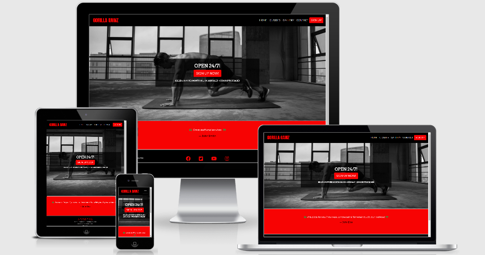
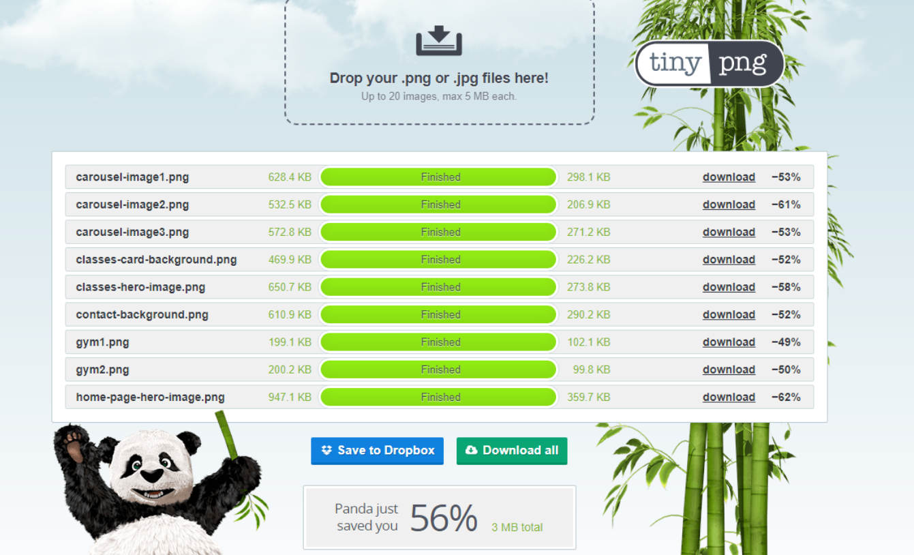
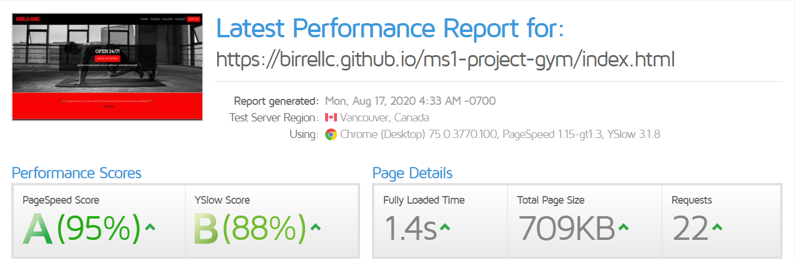
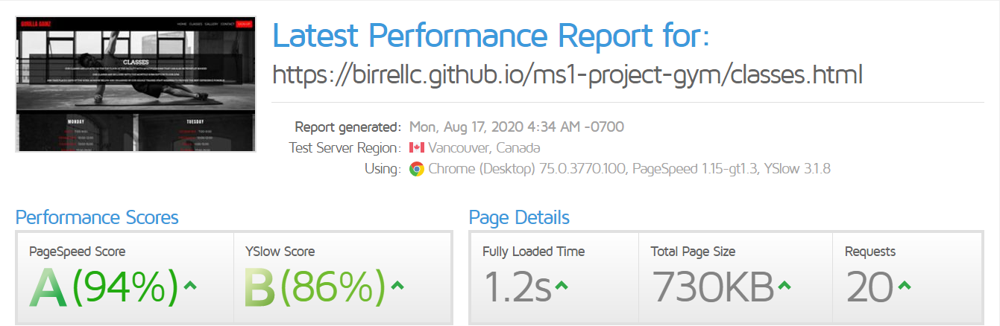
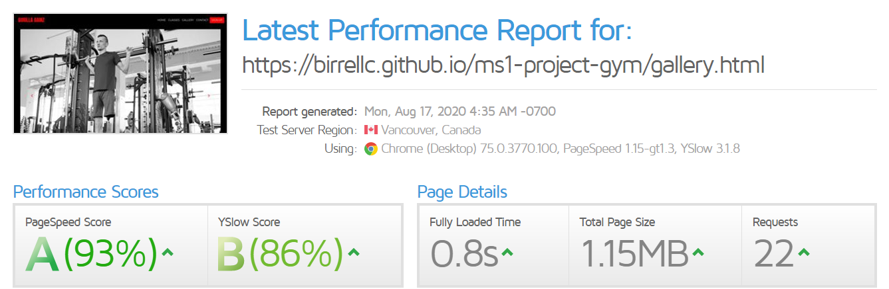
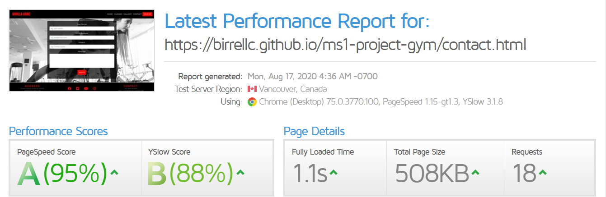
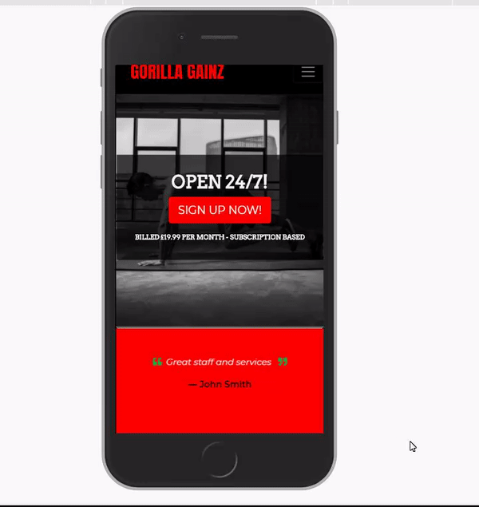

## Description

*this is a ficticious business created for my milestone project 1*

A vintage styled website for a ficticious gym that combines the oldschool style and feel with new and modernised equipment and standards with added classes and availabilty of the facilities 24/7 in which the hope is to attract new members through an minimalistic easy to use website.

[LIVE DEPLOYMENT](https://birrellc.github.io/MS1-GORILLA-GAINZ-GYM/) 

## Wireframe

The completed wireframes for this project can be accesed by clicking [Wireframes](https://github.com/Birrellc/MS1-GORILLA-GAINZ-GYM/tree/master/assets/wireframe/) 

## UX

This website is for a gym where the theme is more vintage bodybuilding meets current fitness, to accomplish this images and colours have been selected as black & white greyscale with a solid red to capture attention while not overloading the user with too much information which could distract from signing up to the gym. 

As the website is built to be responsive on smaller devices the navigation bar will shrink to a drop down menu with a hamburger icon.

Across all pages a footer with social links to allow the user to learn more about the gym itself and also contact details.

* Overview - All pages built to be responsive on mobiles, tablets and desktops to fit in with the target demographic as all 3 uses of the website will be expected to be of use.

* Home - The home page is designed to provide a clear call to action to result in people wanting to sign up to the gym while providing basic information about the gym while also looking attractive to the user. - this has been accomplished by using bootstrap features. the main focus point of this page is a jumbotron in the center with basic information of the gym and also a call to action button to insight users to sign up. Below this is a free rotating carousel showing testimonials to postively reassure the user.

* Classes - The Classes page is used to provide information of what classes are available at the gym and their schedule in order to give the user a clear understanding. Basic infomation is displayed about the classes available then below a resposive grid is used to show the days, classes and times in a row on desktop which shrinks to 2 rows on tablet then a singular row on mobile devices to provide clear information to users with a background image also used in contrast to be eye catching but not too overpowering to the user.

* Gallery - The focus of the Gallery page is showing what the gym looks like but also to provide a positive view to the user by showing members of the gym exercising also. This was achieved by use of a bootstrap carousel cycling 3 images with 2 more images below which move from an inline column to a stacked column when moving to smaller devices.

* Contact - The Contact page has been designed to be simple and easy to use to help the user get in contact with the gym with ease to help create a positive view, the form requires basic user information and email data to be submitted so that the gym can respond the user directly and individually to create a better user experience.

### User Stories

User:

* The user would like to be able to sign up for the gym online.
* The user would like to be able to browse which classes are available at the gym and also what time they are scheduled for.
* The user would like to be able to see the layout and equipment available in the gym.
* The user would like to be able to have access to the gyms social platforms to see if it is the right place for me.
* The user would like to be able to see the pricing of the gym and also its opening hours.
* The user would like to be able to contact the company if any issues arise.

Purpose:

* To provide an easy to use website showcasing the gym and what the gym offers for classes.
* To provide a website that is minimalitic and easy to navigate so the potential client isn't put off by an overload of information.
* To provide a simple to use service for potential clients to sign up and join the gym.
* To provide information as to the location and contact details of the gym.

Designer:

* Minimalistic - To prevent information overload
* Colours - black/white & red in order to combine the vintage style of the gym and its modern elements also while maintaining the strong image associated with fitness and gyms
* Call to action - Clear sign up button located on each page to allow ease of access when signing up
* Responsive - Must be responsive to all platforms to allow ease of use and to increase potential customers for the business

Target Demographic:

* Fitness motivated people
* located in Newcastle
* Likes of fitness classes / free weights / machines
* Professionals & people with disposable income

## Technologies
The technologies i have used for this project are:

* HTML5
* CSS3
* Bootstrap 4

## External resources

* [Stockvault](https://www.stockvault.net/) - Stock image resource.
* [Pexels](https://https://www.pexels.com/) - Stock image resource. 
* [Pinetools - Greyscale](https://pinetools.com/grayscale-image/) - This was used to convert all stock images for the website into black and white photos.
* [Tinypng](http://https://tinypng.com/) - Website used to compress my images to allow for faster loading times. 
* [Autoprefixer](http://autoprefixer.github.io/) - Used to add validators for other browsers eg. mozilla firefox.
* [Stack Overflow](https://fonts.google.com/) - Resource whcih provided the 3 fonts: Anton, Arvo & Montserrat for the website.
* [Font Awesome](https://fontawesome.com/) - Used to provide small icons for the website. eg. Testimonial quotes section.
* [Favicon](https://favicon.io/) - Used to create favicon for the website
* [W3C HTML Validator](https://validator.w3.org/) - Used to test HTML code on the website.
* [W3C CSS Validator](https://jigsaw.w3.org/css-validator/) - Used to test the CSS code on the website.
* [GT Metrix - Speed test](https://gtmetrix.com//) - Used to test the loading speed of the website.

## Testing

### Error Testing

* [W3C HTML Validator](https://validator.w3.org/) - ALL HTML pages passed with no errors after corrections made.
* [W3C CSS Validator](https://jigsaw.w3.org/css-validator/) - CSS style sheet passed with no errors.

### Image Testing

In order to help the website load faster all of the images were removed from the website and then uploaded to [Tinypng](http://https://tinypng.com/) in order to compress the images to more reasonable file sizes to increase loading speed.

### Speed Testing

After compressing all the website images i then chose to run all my pages through [GT Metrix - Speed test](https://gtmetrix.com//) to get a view of the page load speeds to see if this website was suitable for the client to go live with. 

### User Story Testing:

* The user would like to be able to sign up for the gym online.

The user can achieve this by clicking the "sign up now!" button on the jumbotron of the homepage and also from "sign up" on the navbar of all pages - when clicked a modal launches asking for the customer
details and payment plan choice which is then submitted. - Clicking signup via the navigation bar on all pages and also the sign up now button on the homepage successfully laumched the modal with all the correct information required.

* The user would like to be able to browse which classes are available at the gym and also what time they are scheduled for.

The user can see classes information by clicking "classes" on the navigation bar on which takes you to the classes page where details of all classes at the gym can be found at the bottom of the page. - By clicking "classes" link in the navigation bar i was able to access the correct page and information.

* The user would like to be able to see the layout and equipment available in the gym.

The user will see this by clicking on the "gallery" link on the navigation bar which takes the user to a page with a carousel showing gym images with 2 layout images below - clicking the gallery link took me to the correct page.

* The user would like to be able to have access to the gyms social platforms to see if it is the right place for me. 

The user will be able to complete the request by clicking on any of the social icons across the footer of all pages. - each link has been clicked and launches a new window tab with the correct social media site to the image

* The user would like to be able to see the pricing of the gym and also its opening hours.

The user can see this information in the main section of the homepage and the prices are also available again inside the signup modal - by loading the homepage i was able to see the information required was correctly displayed and same when i launched the signup modal link from all pages.

* The user would like to be able to contact the company if any issues arise.

The user can contact the company by clicking the contact section of the navigation bar and filling out the contact form or also looking at the footer across all pages which provides a clickable email and telephone number link - the contact form has been tested via the codeinstitue form dump and displays the correct data when submitted.

### Project End Bug Testing

#### Page overflow bug issue

This was solved by adding "overflow-x: hidden" to html and body elements in style.css - see credit section for source

#### Carousel page reset issue

This issue was solved via the help of codeinstitute slack community where i was informed i had overlooked adding the bootstrap carousel class "carousel-inner" to my outer carousel div which fixed the problem.

## Deployment

* [GORILLA GAINZ](https://birrellc.github.io/MS1-GORILLA-GAINZ-GYM/) site is hosted using GitHub pages.

* The deployed site is hosted directly through github so all commits are live.

* To deploy on github open: https://github.com/Birrellc/MS1-GORILLA-GAINZ-GYM -> settings -> scroll to Guthub Pages -> Select Source -> Master Branch -> Save -> After page refresh scroll pack down to github pages section to see the deployed link.

* For local use please visit: https://github.com/Birrellc/MS1-GORILLA-GAINZ-GYM and clone the relevant code from the master branch by selecting code -> Then copy the url -> Open Git Bash on your system -> Change the current directory to where you want the clone to be made -> type "git clone" and paste the URL eg "https://github.com/Birrellc/MS1-GORILLA-GAINZ-GYM.git" -> Press Enter to create your local clone

## Credits

* First Credits go to my mentor Felipe Alarcon and the Codeinstitute/slack group for the support and help with ideas with this project.

### Inspiration
* Inspiriation for this website comes solely from my interests in Health & Fitness

### Media 

* [Stockvault](https://www.stockvault.net/) 
* [Pexels](https://https://www.pexels.com/)

### Credited Code  
* [Bootstrap](https://getbootstrap.com/) - Documents used for support with bootstrap classes, creation of my carousel's & grid system which this website is based on.
* [Bootstrap - examples](https://getbootstrap.com/docs/4.0/examples/checkout/) - This link is where i got my sign up modal and i just modified it to suit the needs of my website.
* [CSS-Tricks - Forum](https://css-tricks.com/forums/topic/overflow-x-hidden-on-htmlbody-element/) - This forum post was used to help me fix my overflow issue show in bugs section.
* [Stackoverflow - Forum](https://stackoverflow.com/questions/49391266/change-bootstrap-4-carousel-control-colors/49391884) - I was having an issue where my carousel control switches on my gallery.html page were hard to see due to my greyscale image but with this code i was able to change the color to a shade of red.

